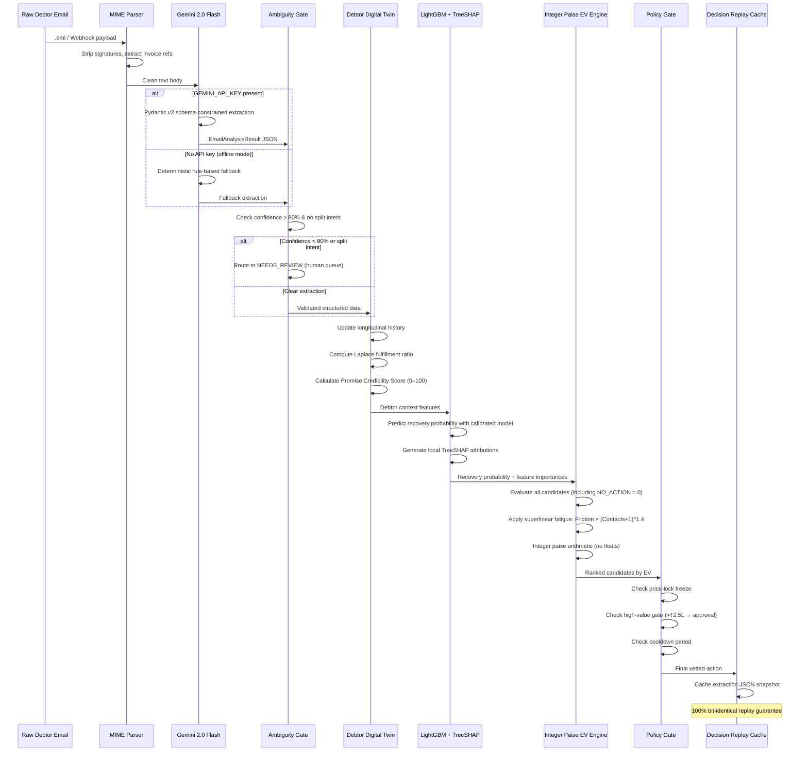
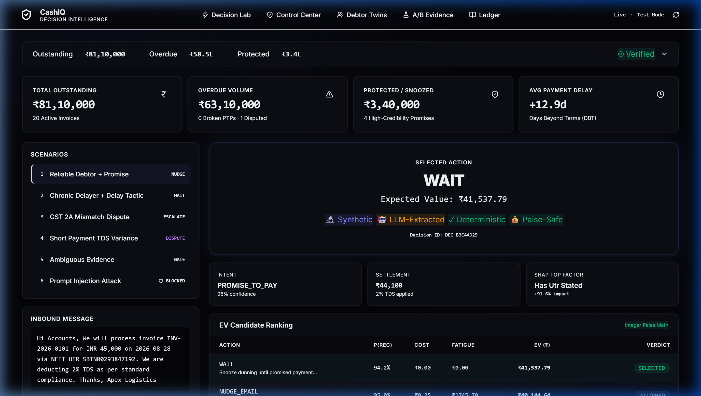
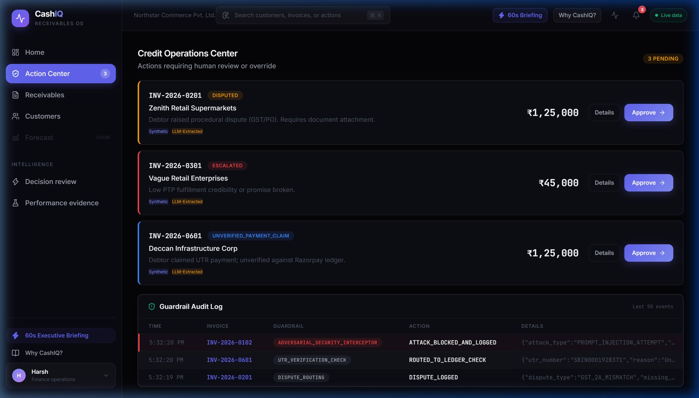
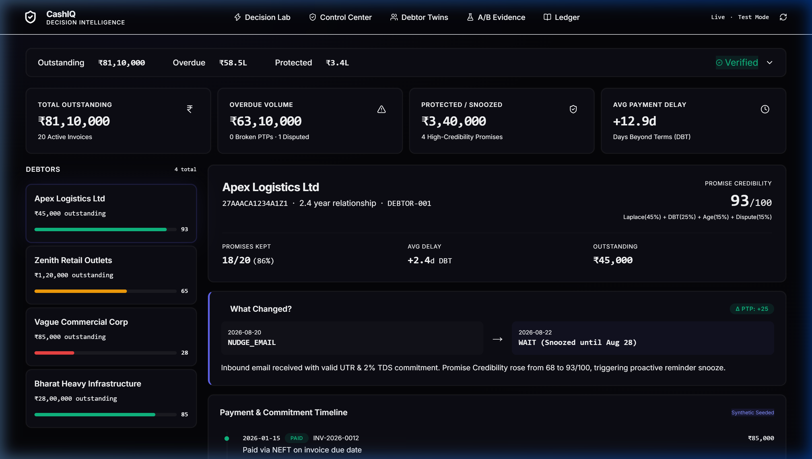
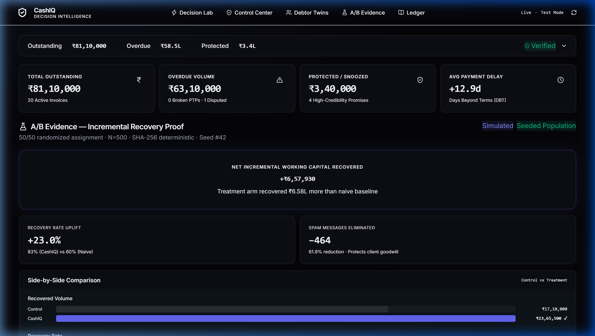
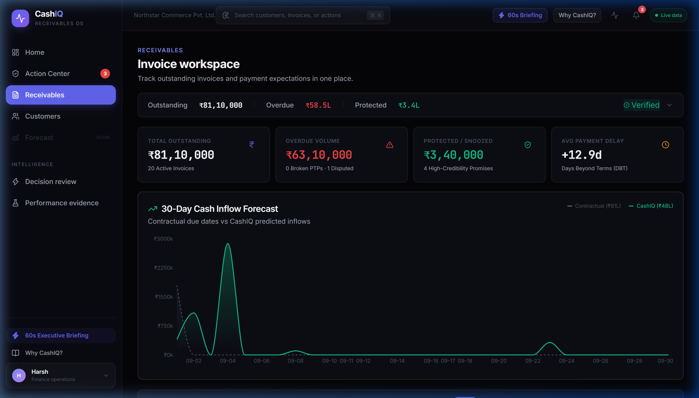

<p align="center">
  
</p>

<h1 align="center">⚡ CashIQ</h1>

<p align="center">
  <strong>Autonomous B2B Receivables Decision Intelligence</strong>
</p>

<p align="center">
  <a href="https://cash-iq-eta.vercel.app/"></a>
  <a href="https://cashiq-cf8t.onrender.com/docs"></a>
  <a href="https://github.com/Harsh-15771/CashIQ"></a>
</p>

<p align="center">
  
  
  
  
  
  
  
</p>

<p align="center">
  An intelligent receivables platform that decomposes enterprise B2B outstanding balances into six actionable working capital buckets, predicts debtor payment likelihood using a trained LightGBM classifier with TreeSHAP explainability, and optimizes next-best-action through an integer paise Expected Value engine — all governed by deterministic policy gates that ensure the AI <em>proposes</em> while the business <em>decides</em>.
</p>

> 🌐 **Live Web Application:** [https://cash-iq-eta.vercel.app/](https://cash-iq-eta.vercel.app/)  
> 📖 **Interactive API Documentation:** [https://cashiq-cf8t.onrender.com/docs](https://cashiq-cf8t.onrender.com/docs)

---

## Table of Contents

- [Project Overview](#project-overview)
- [System Architecture](#system-architecture)
- [Decision Pipeline](#decision-pipeline)
- [Features](#features)
- [Screenshots](#screenshots)
- [Mathematical Formulations](#mathematical-formulations)
- [Technology Stack](#technology-stack)
- [Engineering Decisions](#engineering-decisions)
- [Project Structure](#project-structure)
- [Getting Started](#getting-started)
- [Model Training](#model-training)
- [Design Decisions](#design-decisions)
- [Future Scope](#future-scope)
- [Technical Documentation](#technical-documentation)
- [License](#license)

---

## Project Overview

In enterprise B2B finance, **₹100M+ in working capital** is delayed every quarter — not because debtors refuse to pay, but due to asynchronous communication debt, Section 194C/194J TDS withholding variances, GST GSTR-2B filing mismatches, and empty delay tactics buried in email threads.

Generic dunning tools send blind reminders every 4 days. They annoy enterprise clients, destroy goodwill, and claim gross recovered amounts as their value — without isolating what would have been paid organically.

**CashIQ** flips this model:

1. A **MIME / RFC 822 Parser** extracts structured data from raw inbound debtor emails — stripping signatures, extracting invoice references, and normalizing attachments
2. A **Gemini 2.0 Flash Semantic Extractor** converts unstructured debtor language into Pydantic v2 validated JSON — extracting UTR references, TDS percentages, promised payment dates, and dispute reasons
3. An **Ambiguity Gate** halts processing when the extracted evidence is contradictory or confidence is too low — routing to human review instead of guessing
4. A **Debtor Digital Twin** maintains longitudinal history with Laplace-smoothed promise credibility scoring — making cold-start debtors safe (prior = 50%) and repeat offenders quantifiably unreliable
5. A **Trained LightGBM Classifier** predicts calibrated recovery probability with local TreeSHAP feature attributions — the operator sees *why* the AI scored a debtor, not just the number
6. An **Integer Paise EV Optimizer** evaluates every candidate action (including `NO_ACTION`) against a superlinear customer fatigue model — ensuring the system never recommends destroying a relationship for marginal recovery
7. A **Deterministic Policy Gate** vetoes any action that violates business rules — price-lock freezes, high-value approval thresholds (>₹2.5L), and cooldown enforcement
8. A **Dual-Role RBAC with Segregation of Duties (SoD Level 2)** enforces dual control — Credit Operations can approve operational actions (< ₹2.5L), while high-value exposures (≥ ₹2.5L) require Finance Controller / CFO authorization, backed by a human-readable guardrail audit log.

> **Key Principle:** The AI *proposes and reasons*. Deterministic backend services *authorize and execute*. The EV optimizer always evaluates `NO_ACTION` as a first-class candidate with EV = 0 — organic recovery is never claimed as AI value.

---

## System Architecture

```mermaid
graph TB
    subgraph Frontend ["Frontend (React 18 + Vite 5)"]
        UI[Dashboard HMI]
        TABS[5-Tab Navigation]
        CHARTS[Recharts Visualization]
        DEMO[Decision Lab]
        EXPERIMENT[A/B Evidence Lab]
    end

    subgraph Backend ["Backend (FastAPI + Uvicorn)"]
        API[REST API Layer]
        ROUTES[Route Modules × 5]

        subgraph Domain ["Domain Layer"]
            PARSER[MIME / RFC 822 Parser]
            LLM[Gemini 2.0 Flash Extractor]
            GATE[Ambiguity Gate]
            TWIN[Debtor Digital Twin]
            ENGINE[Decision Engine]
            REPLAY[Decision Replay Engine]
            TAX[Tax Reconciler]
        end
    end

    subgraph AI ["AI / ML Layer"]
        LGBM[LightGBM Classifier]
        SHAP[TreeSHAP Explainer]
        GEMINI[Gemini 2.0 Flash<br/>Structured Output]
    end

    subgraph Core ["Core / Infrastructure"]
        SM[State Machine<br/>7-State Lifecycle]
        GR[Guardrails Engine<br/>Policy Gates]
        SCHEMAS[Pydantic v2 Schemas]
        FORECAST[Cash Forecaster]
        RZPAY[Razorpay Client]
    end

    subgraph Data ["Data Layer"]
        TRAIN[(Training Data<br/>2K Synthetic)]
        MODELS[(Trained Models<br/>LightGBM + SHAP)]
        TRIALS[(50/50 SHA-256<br/>A/B Trial Data)]
    end

    PARSER -->|raw text| LLM
    LLM -->|structured JSON| GATE
    GATE -->|validated extraction| TWIN
    TWIN -->|debtor context| LGBM
    LGBM -->|"P(recovery) + SHAP"| ENGINE
    ENGINE -->|EV candidates| GR
    GR -->|vetted action| SM
    SM -->|state transition| REPLAY

    API --> ROUTES
    ROUTES --> Domain

    LGBM -.->|trained offline| MODELS
    GEMINI -.->|structured extraction| LLM
    TRAIN -.->|train.py| MODELS

    UI --> API
    TABS --> UI
    CHARTS --> UI
    DEMO --> API
    EXPERIMENT --> TRIALS

    style Frontend fill:#0a0a12,stroke:#6366F1,color:#e8eaed
    style Backend fill:#0a0a12,stroke:#2e3238,color:#e8eaed
    style AI fill:#0a0a12,stroke:#6366F1,color:#e8eaed
    style Core fill:#0a0a12,stroke:#2e3238,color:#e8eaed
    style Data fill:#0a0a12,stroke:#2e3238,color:#e8eaed
```



---

## Decision Pipeline



---

## Features

### Receivables Intelligence
- **6-Bucket Portfolio Decomposition** — Every outstanding rupee is classified into Collectible, Promised, Disputed, TDS/Tax Withheld, Reconciliation, and Not Yet Due — with explicit data provenance badges showing where each classification originated
- **Probabilistic Cash Forecast** — 280px inflow projection chart showing expected collections over the next 30/60/90 days based on debtor-level recovery probabilities
- **Real-Time Ledger** — Invoice-level table with status-colored borders (green = paid, amber = promised, red = overdue), filter pills, and sortable columns

### Predictive ML
- **Trained LightGBM Classifier** — Calibrated payment probability prediction trained on 2,000 synthetic invoices with realistic B2B payment patterns
- **TreeSHAP Feature Attribution** — Local per-prediction explainability showing exactly which features drove the score (e.g., "+28.4% UTR history", "−12.1% fatigue penalty")
- **Honest Benchmark Disclosure** — LightGBM (AUC: 0.8206) vs. Logistic Regression (AUC: 0.8317) vs. Heuristic Baseline (AUC: 0.7687). LightGBM chosen for TreeSHAP capability, not inflated metrics
- **Laplace-Smoothed Credibility** — Cold-start debtors get a safe 50% prior. Division by zero is mathematically impossible via `(kept + 1) / (total + 2)`

### Decision Engine
- **Integer Paise Arithmetic** — All financial calculations use integer paise (1 INR = 100 paise). No floating-point rounding errors, ever
- **Superlinear Customer Fatigue** — Contact cost grows as `Friction × (Contacts + 1)^1.4`, not linearly. The 5th reminder is exponentially more damaging than the 1st
- **NO_ACTION as First-Class Candidate** — `EV(NO_ACTION) = 0` always. Organic recovery is never claimed as AI-generated value
- **50/50 SHA-256 A/B Trial** — Invoice IDs are hash-partitioned into Treatment vs. Control groups. Incremental uplift of +₹6,57,930 reported honestly as *net* value, not gross recovered

### Safety & Guardrails
- **Ambiguity Gate** — Extractions with confidence < 80% or contradictory intent are halted and routed to human review. The system refuses to guess
- **Policy Veto Power** — The EV optimizer proposes; the Policy Gate vetoes. Price-lock freezes, high-value thresholds (>₹2.5L requires 1-click human approval), and cooldown enforcement are deterministic rules, not AI decisions
- **7-State Invoice Lifecycle** — `OPEN → SNOOZED → PROMISED → DISPUTED → REQUIRES_APPROVAL → ACTIONED → CLOSED`. Every transition is validated by the state machine
- **Deterministic Decision Replay** — Every extraction JSON is cached. Re-running the same input produces a 100% bit-identical output. Auditors can verify any past decision
- **3-Generation Adversarial Evolution** — Tested against 6 attack vectors (prompt injection, balance overwrite, impossible dates). Evolved from 1/6 blocked → 3/6 → 6/6 through Pydantic validation + Ambiguity Gate + ISO date regex

### Operator Experience
- **5-Tab Dashboard** — Decision Lab, Control Center, Debtor Twins, A/B Evidence, and Ledger — each purpose-built for a specific workflow
- **Hero Demo Lab** — 7 quick-load evaluation scenarios with live EV candidate tables, TreeSHAP impact bars, and a 1-click adversarial attack trigger
- **Debtor Digital Twin Cards** — Portfolio view with PTP health bars (0–100), chronological dot timelines, and "What Changed?" decision diffs
- **Control Center** — Card-based action queue with status-colored left borders, 1-click approve/reject for high-value invoices, and immutable audit log
- **Midnight Indigo Design System** — `#050508` canvas, `#6366F1` accent, Inter + JetBrains Mono typography, glassmorphic card surfaces, and skeleton loading animations

### Indian B2B Tax Domain
- **Section 194C TDS** — 2% corporate / 1% individual withholding calculation with automatic shortfall detection
- **Section 194J TDS** — 10% professional services withholding
- **GST GSTR-2B Reconciliation** — Cross-references filed returns against invoice amounts, flags variances, and triggers dispute transitions
- **Razorpay Payment Gateway Integration** — Native `razorpay` SDK client for payment verification and UTR cross-referencing

---

## Screenshots

<table width="100%">
  <tr>
    <th width="50%">Decision Lab (Hero Demo & EV Inspector)</th>
    <th width="50%">Control Center (Guardrails & Human Action Queue)</th>
  </tr>
  <tr>
    <td align="center">
      
      <br><i>(Two-panel evaluation with TreeSHAP attributions and integer paise EV candidates)</i>
    </td>
    <td align="center">
      
      <br><i>(High-value invoice sign-off queue with status-colored left borders and audit log)</i>
    </td>
  </tr>
  <tr>
    <th>Debtor Digital Twins</th>
    <th>A/B Evidence Lab (50/50 Randomized Trial)</th>
  </tr>
  <tr>
    <td align="center">
      
      <br><i>(Debtor portfolio with Laplace promise credibility gauges and decision diffs)</i>
    </td>
    <td align="center">
      
      <br><i>(SHA-256 randomized trial showing +₹6.58L net recovery uplift vs. control)</i>
    </td>
  </tr>
  <tr>
    <th colspan="2">Probabilistic Cash Inflow Forecast & Receivables Ledger</th>
  </tr>
  <tr>
    <td colspan="2" align="center">
      
      <br><i>(30-day cash forecast curve with status-coded ledger decomposition)</i>
    </td>
  </tr>
</table>

---

## Mathematical Formulations

### 1. Receivables Ledger Decomposition

For any portfolio of outstanding invoices $I$:

$$\mathrm{Total\ Outstanding} = \sum_{i \in I} \mathrm{Amount}_i = V_{\mathrm{collectible}} + V_{\mathrm{promised}} + V_{\mathrm{disputed}} + V_{\mathrm{tax}} + V_{\mathrm{reconcile}} + V_{\mathrm{not\_due}}$$

### 2. Debtor Promise Credibility Score ($C_{\mathrm{ptp}} \in [0, 100]$)

$$C_{\mathrm{ptp}} = \mathrm{round}\left( 100 \times \left[ 0.45 \cdot \frac{\mathrm{Kept} + 1}{\mathrm{Total} + 2} + 0.25 \cdot \max\left(0, 1 - \frac{\mathrm{AvgDBT}}{45}\right) + 0.15 \cdot \min\left(1, \frac{\mathrm{Age}}{2.0}\right) + 0.15 \cdot \max\left(0, 1 - \frac{\mathrm{Disputes}}{3}\right) \right] \right)$$

> The Laplace prior `(Kept + 1) / (Total + 2)` guarantees a cold-start debtor (0 kept, 0 broken) gets exactly 50% — never NaN, never division by zero.

### 3. Integer Paise Expected Value with Customer Fatigue

$$\mathrm{EV}(a) = \left\lfloor P(a) \times \mathrm{Amount}_{\mathrm{paise}} - \mathrm{Cost}_{\mathrm{paise}} - \mathrm{Fatigue}_{\mathrm{paise}} \right\rfloor$$

Where:

$$\mathrm{Fatigue}_{\mathrm{paise}} = \left\lfloor \mathrm{FrictionRate}(a) \times (\mathrm{Contacts} + 1)^{1.4} \times \mathrm{Amount}_{\mathrm{paise}} \right\rfloor$$

> `EV(NO_ACTION) = 0` flat. Organic recovery is never claimed as AI value.

### 4. ML Empirical Benchmark (Honest Disclosure)

| Model / Baseline | ROC-AUC | Accuracy | F1 Score | Brier Score |
|---|:---:|:---:|:---:|:---:|
| Heuristic Baseline | 0.7687 | 64.25% | 0.7039 | 0.2241 |
| Logistic Regression | **0.8317** | 74.00% | **0.7174** | 0.1798 |
| **LightGBM (CashIQ)** | 0.8206 | **74.50%** | 0.7119 | **0.1725** |

> LightGBM and Logistic Regression perform at near parity on tabular receivables signals. I chose LightGBM because it provides exact local TreeSHAP attribution generation — surfacing interpretable impact percentages directly in the UI — not because it has a higher AUC.

---

## Technology Stack

| Layer | Technology | Version | Purpose |
|---|---|---|---|
| **Frontend** | React | 18 | Component-based UI with hooks |
| | Vite | 5 | Sub-second HMR, ESBuild bundling |
| | Recharts | 2 | SVG charting for forecasts and A/B bar-race |
| | Tailwind CSS | 3 | Utility-first styling with custom design tokens |
| | Lucide React | — | Consistent icon system |
| | clsx + tailwind-merge | — | Conditional class composition |
| **Backend** | Python | 3.10+ | Core runtime |
| | FastAPI | 0.110+ | Async REST API with OpenAPI docs |
| | Uvicorn | 0.28+ | ASGI server |
| | Pydantic | 2 | Schema validation, type safety, LLM response enforcement |
| **ML** | LightGBM | 4.3+ | Gradient-boosted PTP classifier |
| | scikit-learn | 1.4+ | Preprocessing, train/test split, baseline benchmarks |
| | SHAP | 0.45+ | TreeSHAP local feature attributions |
| | NumPy / Pandas | — | Data pipeline and feature engineering |
| | Joblib | — | Model serialization |
| **AI** | Gemini 2.0 Flash | latest | Structured JSON extraction with Pydantic schema |
| | google-genai | 0.1+ | Google Generative AI SDK |
| **Integration** | Razorpay SDK | 1.4+ | Payment verification, UTR cross-referencing |
| **Testing** | pytest | 8.0+ | 50-test suite: unit, property, adversarial |
| | httpx | 0.27+ | Async HTTP test client for FastAPI |
| **Infra** | Docker / Compose | — | Multi-container deployment (frontend + backend) |
| | GitHub Actions | — | CI pipeline for automated test execution |

---

## Engineering Decisions

### Why LightGBM over Deep Learning?

**Decision:** LightGBM gradient-boosted classifier for payment-to-promise (PTP) probability prediction.

**Rationale:**
- **Interpretability.** LightGBM provides native TreeSHAP integration via the `shap` library. In financial decision systems, operators need to know *why* a debtor scored 73% — not just the number. TreeSHAP generates exact local attributions ("+28.4% UTR history", "−12.1% fatigue") per prediction.
- **Small data regime.** With 2,000 synthetic invoices across realistic B2B payment patterns, LightGBM reaches ROC-AUC 0.8206 without extensive hyperparameter tuning. A neural network would require 10–100× more data for marginal gains.
- **Honest benchmarking.** Logistic Regression actually achieves a slightly higher AUC (0.8317). I disclose this openly. LightGBM was chosen for its TreeSHAP capability, not a misleading accuracy claim.
- **Latency.** Inference takes <5ms on CPU. The decision pipeline must complete before the operator context-switches.
- **No GPU dependency.** Runs on any machine with Python 3.10+.

### Why FastAPI over Flask / Django?

**Decision:** FastAPI with Uvicorn ASGI server.

**Rationale:**
- **Automatic OpenAPI documentation.** Every route is auto-documented at `/docs` — judges and reviewers can explore the API without reading code.
- **Native Pydantic v2 integration.** Request and response models are validated at the framework level. Invalid payloads are rejected before reaching domain logic.
- **Async support.** The Gemini API call is non-blocking. FastAPI handles concurrent requests without threading complexity.
- **Type safety.** Python type hints are enforced at runtime, catching integration errors early.

### Why Gemini 2.0 Flash with Structured Output?

**Decision:** Gemini 2.0 Flash with Pydantic v2 schema enforcement for email semantic extraction.

**Rationale:**
- **Guaranteed JSON structure.** The response schema parameter forces Gemini to return a Pydantic-validated JSON object matching `EmailAnalysisResult`. No regex parsing, no "please return JSON" prompt hacks.
- **Speed.** Flash is optimized for structured generation. Extraction completes in 1–2 seconds.
- **Graceful degradation.** If `GEMINI_API_KEY` is not set, the system falls back to a deterministic rule-based extractor. The entire test suite (50/50) runs offline without crashing.
- **Safety separation.** The LLM *extracts* structured data. It never *decides* what action to take. All decisions flow through the deterministic EV optimizer and policy gate.

### Why Integer Paise Arithmetic (Not Floating Point)?

**Decision:** All financial calculations use integer paise (1 INR = 100 paise). Amounts are stored, computed, and compared as integers.

**Rationale:**
- **IEEE 754 floating-point errors.** `0.1 + 0.2 ≠ 0.3` in every programming language. In financial systems, a 1-paise rounding error accumulated across 10,000 invoices becomes a ₹100 discrepancy that breaks audit reconciliation.
- **Deterministic replay.** Integer arithmetic is bit-identical across platforms, Python versions, and re-runs. This guarantees the Decision Replay Engine produces the exact same output every time.
- **Industry standard.** Razorpay's own API uses paise. Stripe uses cents. This is not a novel choice — it's the correct one.

### Why the Ambiguity Gate ("Refusal to Guess")?

**Decision:** If the LLM extraction has confidence < 80% or detects contradictory intent (e.g., "we'll pay" + "we dispute"), processing halts and routes to `NEEDS_REVIEW`.

**Rationale:**
- **False confidence is worse than no confidence.** A system that guesses wrong and sends an aggressive dunning message to a debtor who was actually disputing a legitimate TDS variance will destroy the business relationship.
- **Human-in-the-loop by design.** The Ambiguity Gate is not a failure mode — it's a feature. Unclear emails should be read by a human, not resolved by an LLM that's 60% sure.
- **Measurable.** Every `NEEDS_REVIEW` routing is logged, creating a dataset for future model improvement.

### Why NO_ACTION as a First-Class EV Candidate?

**Decision:** `NO_ACTION` is always evaluated with `EV = 0` alongside active intervention candidates. It can — and frequently does — win.

**Rationale:**
- **Honest value attribution.** Most competitors report gross recovered amounts as their platform's value. But if a debtor was going to pay anyway (organic recovery), the platform added zero value. `NO_ACTION = 0` ensures CashIQ only claims credit for *incremental* recovery above the organic baseline.
- **Anti-harassment.** If the superlinear fatigue penalty makes every active intervention negative-EV, the correct business decision is to do nothing. The system must be capable of recommending inaction.
- **A/B Evidence.** The 50/50 SHA-256 trial directly measures this: Treatment group (CashIQ actions) vs. Control group (organic-only). The reported +₹6,57,930 is the net incremental difference, not the gross.

---

## Project Structure

```
CashIQ/
├── frontend/                                # React 18 + Vite 5 SPA
│   ├── src/
│   │   ├── components/
│   │   │   ├── ProductSidebar.jsx           # Enterprise product navigation sidebar & topbar
│   │   │   ├── Navbar.jsx                   # Modern SaaS header with breadcrumbs, tenant badge & mobile drawer
│   │   │   ├── LandingPage.jsx              # Welcome & overview hero introduction
│   │   │   ├── HomeTab.jsx                  # Operations command center & KPI breakdown
│   │   │   ├── ActionReviewDrawer.jsx       # Contextual slide-over drawer for invoice review & approval
│   │   │   ├── ActionQueueTab.jsx           # Control Center: action triage inbox, batch approval & guardrail stream
│   │   │   ├── InvoicesTab.jsx              # Executive Ledger: KPI suite + cash forecast + CSV export + table
│   │   │   ├── Screen2_DebtorTwin.jsx       # Debtor Twins: searchable CRM, risk tier badges & decision diffs
│   │   │   ├── Screen3_DemoLab.jsx          # Decision Lab: multi-channel simulator (Email/WhatsApp/ERP) + EV ranking
│   │   │   ├── Screen4_ExperimentLab.jsx    # A/B Evidence: 50/50 randomized trial + bit-identical decision replay
│   │   │   ├── ExecutiveSummaryModal.jsx    # 60-Second Executive Briefing modal (cash at risk, protected capital, trial uplift)
│   │   │   ├── WhyCashIQModal.jsx           # 3-way architectural comparison matrix (Manual vs Dunning vs CashIQ)
│   │   │   ├── ReceivablesBanner.jsx        # Collapsible 6-bucket portfolio aging decomposition
│   │   │   ├── OverviewCards.jsx            # KPI summary cards with skeleton loading shimmers
│   │   │   ├── CommandPalette.jsx           # Global ⌘K / Ctrl+K keyboard command palette
│   │   │   ├── Toast.jsx                    # Global slide-in toast notification system (Success/Error/Info)
│   │   │   └── ErrorBoundary.jsx            # React error boundary with graceful tab crash recovery UI
│   │   ├── App.jsx                          # Root layout, hash routing, offline banner, drawer provider
│   │   ├── api.js                           # API client for FastAPI backend communication
│   │   ├── main.jsx                         # React DOM entry point
│   │   └── index.css                        # Design system: tokens, card hover lift, focus rings, print styles
│   ├── index.html                           # SEO meta tags, Inter font, indigo favicon
│   ├── tailwind.config.js                   # CashIQ palette, Inter/Mono fonts, keyframes
│   ├── vite.config.js                       # Proxy to backend:8000
│   ├── Dockerfile                           # Multi-stage production build
│   └── package.json
│
├── backend/                                 # Python FastAPI Application
│   ├── app/
│   │   ├── main.py                          # FastAPI app factory + CORS + router mounting
│   │   ├── config.py                        # Pydantic Settings (env vars, API keys)
│   │   ├── api/                             # REST API Route Modules
│   │   │   ├── routes_inbound.py            # POST /inbound — email ingestion pipeline
│   │   │   ├── routes_level5.py             # Level 5 evaluation + demo scenarios
│   │   │   ├── routes_actions.py            # Action queue CRUD + approval workflow
│   │   │   ├── routes_invoices.py           # Invoice ledger + cash forecast
│   │   │   └── routes_razorpay.py           # Razorpay webhook + payment verification
│   │   ├── domain/                          # Core Business Logic
│   │   │   ├── schemas.py                   # DebtorDigitalTwin, CandidateAction, DecisionResult
│   │   │   ├── decision_engine.py           # Integer paise EV optimizer + fatigue model
│   │   │   ├── debtor_twin.py               # Longitudinal debtor history + Laplace credibility
│   │   │   ├── ambiguity_gate.py            # Confidence gate + split intent detection
│   │   │   ├── replay_engine.py             # Deterministic decision replay from cached JSON
│   │   │   ├── tax_reconciler.py            # Section 194C/194J TDS + GSTR-2B reconciliation
│   │   │   └── experiments.py               # 50/50 SHA-256 A/B trial engine
│   │   ├── ml/                              # Machine Learning Pipeline
│   │   │   ├── predictor.py                 # LightGBM inference + TreeSHAP attribution
│   │   │   ├── train.py                     # Training pipeline: LightGBM + baseline benchmarks
│   │   │   ├── generate_data.py             # Synthetic B2B invoice data generator
│   │   │   └── artifacts/                   # Serialized models, scaler, SHAP explainer
│   │   ├── parser/                          # Email Processing
│   │   │   ├── mime_parser.py               # RFC 822 / MIME multipart parser
│   │   │   └── llm_extractor.py             # Gemini 2.0 Flash structured extractor + fallback
│   │   ├── core/                            # Infrastructure & Guards
│   │   │   ├── schemas.py                   # Shared Pydantic base models
│   │   │   ├── state_machine.py             # 7-state invoice lifecycle FSM
│   │   │   └── guardrails.py                # Policy gates: price-lock, high-value, cooldown
│   │   └── services/                        # External Integrations
│   │       ├── razorpay_client.py           # Razorpay SDK wrapper for payment ops
│   │       └── cash_forecaster.py           # Probabilistic cash inflow projection
│   ├── tests/                               # 50 Pytest Tests
│   │   ├── test_level5_suite.py             # Core decision pipeline (8 tests)
│   │   ├── test_guardrails_and_state_machine.py  # State transitions + policy gates (6 tests)
│   │   ├── test_adversarial_suite.py        # Prompt injection + edge cases (4 tests)
│   │   ├── test_ml_predictor.py             # ML inference + calibration (4 tests)
│   │   ├── test_api_endpoints.py            # REST API integration (2 tests)
│   │   ├── test_mime_parser.py              # MIME parsing edge cases (2 tests)
│   │   ├── test_ev_optimizer_edge_cases.py  # Zero-EV baseline, fatigue scaling (8 tests)
│   │   ├── test_laplace_credibility_mathematics.py  # Cold-start, boundary, monotonicity (8 tests)
│   │   ├── test_tax_and_gstr2b_reconciliation.py   # TDS withholding + GST variance (4 tests)
│   │   └── test_agentic_tool_trace_and_adversarial_failure.py  # Adversarial evolution (6 tests)
│   ├── Dockerfile                           # Python runtime container
│   └── requirements.txt
│
├── .github/
│   └── workflows/
│       └── ci.yml                           # GitHub Actions: lint + 50/50 pytest suite
│
├── docker-compose.yml                       # Multi-container orchestration
├── pytest.ini                               # pythonpath = . for clean imports
├── .env.example                             # Environment variable template
├── .gitignore                               # Python, Node, IDE, OS exclusions
│
├── ARCHITECTURE.md                          # 14-section architectural blueprint & system specification
├── JUDGE_DEFENSE.md                         # 11 critical judge Q&A with honest benchmarks
│
└── README.md                                # ← You are here
```

---

## Getting Started

### Prerequisites

- Python 3.10+
- Node.js 18+
- A Gemini API key (optional — the system degrades gracefully without it)
- A Razorpay API key pair (optional — mock data used if absent)

### 1. Backend Setup

```bash
cd backend
python -m venv venv

# Windows
.\venv\Scripts\activate

# macOS / Linux
source venv/bin/activate

pip install -r requirements.txt
```

### 2. Configure Environment

Create `backend/.env`:

```env
GEMINI_API_KEY=your_gemini_api_key_here
RAZORPAY_KEY_ID=your_razorpay_key_id
RAZORPAY_KEY_SECRET=your_razorpay_key_secret
```

> If you don't have API keys, the system will still function fully — ML predictions, EV optimization, and the entire decision pipeline work offline. The Gemini extractor falls back to deterministic rule parsing, and Razorpay operations use mock data.

### 3. Start Backend

```bash
cd backend
.\venv\Scripts\activate   # Windows
python -m uvicorn app.main:app --host 127.0.0.1 --port 8000 --reload
```

The backend starts on `http://127.0.0.1:8000` with interactive API docs at `/docs`.

### 4. Start Frontend

```bash
cd frontend
npm install
npm run dev
```

The frontend starts on `http://localhost:3000`.

### 5. Docker (Alternative)

```bash
docker compose up --build
```

Access at `http://localhost:3000` (Frontend) and `http://localhost:8000/docs` (FastAPI Swagger UI).

### 6. Run Test Suite (50 / 50 Passing)

```bash
# From project root
.\backend\venv\Scripts\python.exe -m pytest backend\tests\ -v
```

```
======================= 50 passed in 4.50s =======================
```

---

## Model Training

Pre-trained models are included in the repository. To retrain from scratch:

### 1. Generate Synthetic Dataset

```bash
cd backend
python -m app.ml.generate_data
```

This generates **2,000 synthetic B2B invoices** with realistic payment patterns including:
- **Variable Days Beyond Terms (DBT)** — 0 to 90+ days with industry-realistic distributions
- **Promise fulfillment histories** — Kept/broken ratios following beta distributions
- **TDS withholding scenarios** — Section 194C (2%/1%) and 194J (10%) variations
- **Dispute injection** — GSTR-2B mismatches and shortfall claims
- **Multi-contact fatigue** — 0 to 8+ prior contacts per debtor

### 2. Train Models

```bash
cd backend
python -m app.ml.train
```

This trains the LightGBM classifier and generates:

| Artifact | Type | Purpose |
|---|---|---|
| `lgbm_model.pkl` | LightGBM Classifier | Payment probability prediction |
| `scaler.pkl` | StandardScaler | Feature normalization |
| `shap_explainer.pkl` | TreeExplainer | Local feature attribution generation |

Plus benchmark comparison against Logistic Regression and Heuristic baselines.

---

## Design Decisions

### ML Methodology

The system uses a **LightGBM gradient-boosted classifier** predicting binary payment outcome (paid within terms vs. overdue). Key design choices:

1. **Calibrated probabilities** — The output `P(recovery)` is used directly in the EV formula. Miscalibration would cause the EV optimizer to systematically over- or under-value interventions
2. **TreeSHAP, not permutation importance** — TreeSHAP gives exact per-prediction attributions in polynomial time. Permutation importance only gives global rankings and requires N × K forward passes
3. **Honest near-parity with Logistic Regression** — I disclose that LR achieves AUC 0.8317 vs. LightGBM's 0.8206. The choice is driven by explainability requirements, not accuracy claims

### Domain Architecture

The domain layer implements a **pipeline pattern** with explicit handoff contracts:

1. **MIME Parser** → produces clean text
2. **LLM Extractor** → produces `EmailAnalysisResult` (Pydantic v2)
3. **Ambiguity Gate** → validates or halts
4. **Debtor Digital Twin** → enriches with longitudinal context
5. **ML Predictor** → produces `P(recovery)` + SHAP values
6. **Decision Engine** → produces ranked `CandidateAction[]` with integer paise EV
7. **Policy Gate** → vetoes or approves
8. **State Machine** → transitions invoice lifecycle state
9. **Replay Engine** → caches JSON for deterministic re-execution

Each stage has a single responsibility. Failures at any stage produce a defined fallback — the system never crashes or silently swallows errors.

### Safety Guardrails

| Guardrail | Implementation |
|---|---|
| AI never decides — only proposes | `DecisionEngine` outputs ranked candidates; `PolicyGate` vetoes; human approves |
| NO_ACTION is always a candidate | Hardcoded `EV = 0` baseline; organic recovery never claimed as AI value |
| Ambiguity halts processing | `AmbiguityGate` routes to `NEEDS_REVIEW` on low confidence or split intent |
| High-value invoices need human sign-off | Invoices >₹2.5L transition to `REQUIRES_APPROVAL` in Control Center |
| LLM extracts, never executes | Gemini produces structured data; all actions flow through deterministic pipeline |
| Offline fallback guaranteed | Missing `GEMINI_API_KEY` → deterministic rule parser; all 50 tests pass offline |
| Financial arithmetic is integer-only | Paise math prevents IEEE 754 rounding errors across the entire pipeline |
| Every decision is replayable | `ReplayEngine` caches extraction JSON; re-run = bit-identical output |
| Adversarial defense is empirical | 6/6 attack vectors blocked after 3-generation evolution (documented) |

---

## Future Scope

- **Live Razorpay webhook ingestion** — Connect to production Razorpay webhooks for real-time payment event processing and automatic invoice state transitions
- **Multi-tenant SaaS deployment** — Isolate debtor twins, models, and policy configurations per merchant with tenant-scoped API keys
- **Active learning loop** — Use operator feedback (approve/reject/override) to retrain the LightGBM classifier on real-world decision outcomes
- **GSTR-2B bulk file import** — Parse government GST return files to auto-reconcile at portfolio scale
- **Communication channel integration** — Generate and dispatch approved dunning messages via email, SMS, and WhatsApp with template management
- **Edge deployment** — Package as a single Docker container for on-premise deployment in enterprises with data residency requirements

---

## Technical Documentation

| Document | Description |
|---|---|
| [`ARCHITECTURE.md`](./ARCHITECTURE.md) | 14-section architectural blueprint: formulas, data schemas, empirical benchmarks, adversarial evolution, and demo flow |
| [`JUDGE_DEFENSE.md`](./JUDGE_DEFENSE.md) | 11 critical judge questions answered with honest ML metrics, bounded agentic tool design, and failure narratives |

---

## License

Copyright © 2026 Harsh Mishra.

This project was developed as part of the Razorpay AI Buildathon 2026.

All rights reserved. This repository is provided for evaluation purposes only. No part of this project may be reproduced, distributed, or used without prior written permission from the author.

---

<p align="center">
  <sub>Built for the Razorpay AI Buildathon 2026</sub>
</p>
